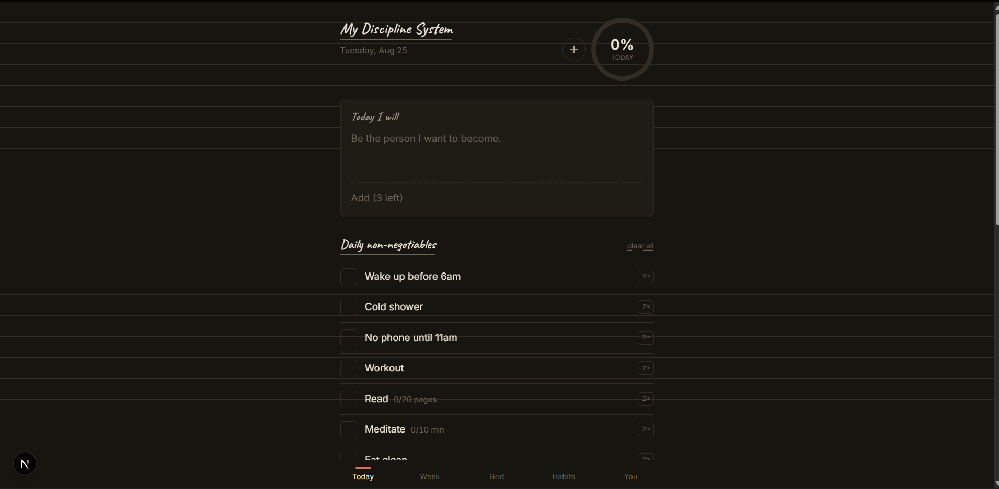

<div align="center">


# La Paece — Discipline

**A behavioural and progress tracker that refuses to lie to you about how your week is going.**

Paper-inspired, mobile-first PWA · Next.js 15 · Express · Postgres · Prisma · TypeScript

</div>



---

## What this is

A single-user habit and behaviour tracker. It does the obvious things — tick a
box, see a streak, look at a month grid — but almost every rule underneath is
deliberately *not* the default one a checkbox app would pick, because the
default is usually the reason people abandon trackers in week three.

The short version of the philosophy: **the number on the screen has to be
trustworthy, or there's no point having it.** That means unscheduled days can't
count as failures, a single bad day can't erase two months, an unticked box at
lunchtime isn't a miss yet, and a target you can no longer reach gets called out
on Thursday instead of quietly running out the week.

---

## The decisions worth knowing

These are the places where the obvious implementation is wrong.

| Rule | Why |
|---|---|
| **The day ends at 4am, not midnight** (configurable) | Log something at 12:40am and you mean *yesterday*. This is the single most common source of bugs in trackers. |
| **Entries store a number, not a boolean** | `1`/`0` for binary habits, the real amount for quantity habits. Partial credit is proportional and capped at 100% — drinking 4.2L of a 3L target is not a 140% day. |
| **The daily % is weighted** | Non-negotiables count `nonNegotiableWeight`× (default 2×) a bonus habit. At 1×, "stretch" papers over a missed workout and the headline number stops meaning anything. |
| **Two numbers, not one** | Today's %, and month-to-date average. A single ambiguous figure is a design flaw. |
| **Unscheduled ≠ missed** | A rest day renders `–` and is excluded from the denominator. So are days before a habit existed. Habits archive rather than delete, so history is never silently rewritten. |
| **Unticked ≠ missed** | An empty box on an unfinished day is `pending`. Only an explicitly logged zero — via a miss reason — is a miss. Unticking a box *clears* the entry rather than recording a failure. |
| **Streaks forgive one miss, break on two** | Hard-reset streaks are the biggest cause of tracker abandonment: one bad day invalidates months, so people quit rather than restart at zero. |
| **Backfill is allowed but marked** | Today and yesterday are freely editable. Anything older needs explicit confirmation and carries a dot, so the grid can't quietly become fiction. |
| **Three todos. Hard cap.** | A list of twelve is a wish, not a plan. Unfinished ones roll forward with a counter; 3+ days is a signal the task was never a one-day job. |
| **Weekly targets anchor to a trailing average** | Pre-filled from your 4-week baseline +3.5 points. Anything above +10 requires acknowledging a warning — leaping 51% → 90% is exactly how week one fails. |
| **Rebaselining *down* is first-class** | A target that only ratchets upward eventually guarantees failure. When one becomes mathematically unreachable the app says so and offers a still-achievable number. |
| **Why you missed is captured** | Energy 1–5, mood 1–5, and a one-tap reason on any missed non-negotiable. ~10 seconds a day, and it's the only data a checkbox can't give you. Insights are v2 — but you can't retroactively collect data you never gathered. |
| **Night mode is a designed theme, not an inversion** | You close out the day in a dark room at 10:30pm. A full-brightness cream page there is hostile. |

---

## Quick start

**Prerequisites:** Node 20.12+ (uses `process.loadEnvFile`; developed on 24) and a Postgres database.

```bash
cp .env.example .env      # then set JWT_SECRET, APP_EMAIL, APP_PASSWORD, DATABASE_URL
npm install
npm run db:migrate        # create the schema
npm run db:seed           # create your user + 15 starter habits
npm run dev               # api :4000, web :3000
```

Open <http://localhost:3000> and log in with your `APP_EMAIL` / `APP_PASSWORD`.

> `.env` is authored once at the repo root. Every `dev`, `build`, and `db:*`
> script runs `npm run env` first, which copies it to `api/.env` and
> `web/.env.local` — the Prisma CLI and Next each only read env files beside
> their own package.

**Need a database?** Any Postgres will do:

```bash
docker run -d --name pt-db -e POSTGRES_PASSWORD=postgres \
  -e POSTGRES_DB=progress_tracker -p 5432:5432 postgres:16
```

**On your phone:** run `next dev -H 0.0.0.0`, point `NEXT_PUBLIC_API_URL` and
`WEB_ORIGIN` at your machine's LAN IP, and open it in Safari or Chrome. iOS only
delivers PWA push notifications once the app is on the home screen, so "Add to
Home Screen" is a required step rather than a nicety.

### If you're using a hosted database

Prefer a **local** Postgres for development. Running against a remote instance
over a public TCP proxy costs a full round trip per query, and pages here issue
several — expect multi-second loads that have nothing to do with the app.

If you do point at one, append these to `DATABASE_URL`:

```
?connect_timeout=30&pool_timeout=30&connection_limit=5
```

Prisma's default `connect_timeout` is 5 seconds. A cold connection through
Railway's public proxy measured **~6.8s**, so the default produces intermittent
`P1001 Can't reach database server` errors that look like random failures.

---

## Scripts

| Command | What it does |
|---|---|
| `npm run dev` | API on `:4000` and web on `:3000`, together |
| `npm run build` | Compile both workspaces |
| `npm test` | 17 domain tests — progress, streaks, pace, date boundaries. No database needed |
| `npm run typecheck` | `tsc --noEmit` across both workspaces |
| `npm run db:migrate` | Apply Prisma migrations |
| `npm run db:seed` | Create the user and starter habits; re-running updates the password |
| `npm run db:studio` | Prisma Studio |
| `npm run env` | Fan the root `.env` out to the workspaces |

---

## Screens

| Route | What it is |
|---|---|
| `/` | **Today.** Intention, three todos, habit checkoff, evening close-out. |
| `/week` | **Week.** The commitment, live pace, and day-by-day bars. |
| `/grid` | **Grid.** The month matrix from the notebook page. |
| `/habits` | **Habits.** Manage habits, targets, and which weekdays each is scheduled. |
| `/settings` | **You.** Theme, day boundary, non-negotiable weight, timezone. |
| `/login` | Single-user sign-in. |

### Interactions worth knowing

- **Long-press** a habit checkbox on mobile, or **right-click** on desktop, to
  edit, archive, or permanently delete it. There's deliberately no `⋯` on the
  check rows — a permanent affordance on a list you tap ten times a day
  outweighs the thing it manages.
- **`+`** in the Today header adds a habit without leaving the screen.
- **Non-negotiables** are square checks with a `2×` weight badge.
  **Other habits** are lighter circles worth a single point — the two can never
  be mistaken for equal marks.
- **Coachmarks** explain each screen once on first visit. Replay them any time
  from Settings → *Show the walkthrough again*.

---

## Architecture

```
api/
  prisma/schema.prisma       data model
  prisma/seed.ts             your user + starter habits
  src/env.ts                 loads .env first; refuses to boot without JWT_SECRET
  src/auth.ts                JWT cookie session + requireAuth
  src/domain/                pure logic — progress, streaks, weekly pace
  src/domain/domain.test.ts  17 tests, no DB required
  src/services/tracker.ts    Prisma -> domain
  src/routes/                habits · entries · days · todos · week · views · auth
  src/jobs/rollover.ts       hourly todo carry-forward
  src/lib/dates.ts           timezone + day-boundary helpers
  src/lib/asyncRoutes.ts     forwards async rejections to the error handler
web/
  app/                       the six screens
  components/                Check · Ring · Nav · HabitRow · loader · Coachmarks
                             ActionMenu · HabitForm · Disclosure · Portal
  lib/api.ts                 fetch client with retries
  lib/progress.ts            client mirror of the weighted maths
  lib/useLongPress.ts        long-press / right-click gesture
  public/                    manifest, service worker, icons
scripts/sync-env.mjs         root .env -> workspaces
```

**The domain layer is pure.** `src/domain/` takes plain objects and returns
plain objects — no Prisma, no Express, no dates-as-timestamps. That's why the
entire behavioural rule set is testable without a database, and why the client
can mirror the same maths for optimistic updates.

**Dates are local-date strings, never timestamps.** `LocalDate` is
`"YYYY-MM-DD"` throughout, resolved in the user's timezone at their configured
day-start hour. Timestamps in a tracker are a bug factory.

---

## Implementation notes

Things that are non-obvious from reading the code, and cost real debugging to
get right.

**Optimistic UI, without the snap-back.** A tap repaints immediately and the
request follows; the ring moves in ~70ms rather than after a round trip.
`web/lib/progress.ts` re-derives the weighted score client-side from the cell
weights the server already sent. A write counter guards the background
reconcile — server state is only applied when no local edit is in flight, so a
slow response can never overwrite a newer tap and visibly jump backwards.

**Async errors can't be allowed to kill the process.** Express 4 predates
promises: it only forwards errors thrown *synchronously*. A rejected `await` in
a handler becomes an unhandled rejection, which Node treats as fatal — so one
dropped database connection took the whole API down until it was restarted.
`src/lib/asyncRoutes.ts` wraps every handler so rejections reach the error
middleware as a 500 instead.

**A database blip is not an expired session.** `requireAuth` used to wrap both
the JWT check and the user lookup in one `try/catch` that answered `401`. Since
the client treats any 401 as "your session is gone", a momentary DB failure
bounced you to the login screen. Token verification and the database lookup are
now separated: only genuine token problems produce a 401.

**Env loading is explicit.** Nothing loaded `.env` on purpose — it worked only
because Prisma Client happens to load one when it initialises, making every
other variable a side effect of module evaluation order. `JWT_SECRET` is read at
module scope, so if `auth.ts` evaluated first it silently fell back to a
hardcoded default, and a secret that differs between boots invalidates every
cookie signed with the previous one. `src/env.ts` loads env files first and
exits rather than starting on a default secret.

**Overlays are portalled to `<body>`.** Every screen root carries `.fade-up`,
whose keyframes end on a `transform` with `fill-mode: both`. A transformed
ancestor becomes the containing block for `position: fixed` descendants — which
silently re-anchored coachmarks, menus, and sheets to the centred `max-w-lg`
column instead of the viewport. `components/Portal.tsx` is the fix that doesn't
depend on remembering never to transform an ancestor again.

**Timezones use `Intl.supportedValuesOf("timeZone")`.** No bundled zone table
and no dependency: the list the runtime returns is the one it will actually
accept, which matters because the string goes straight to `Intl.DateTimeFormat`
on the server.

---

## API reference

All routes are cookie-authenticated except `POST /auth/login`. Dates are
`YYYY-MM-DD` local dates.

### Auth
| Method | Path | Notes |
|---|---|---|
| `POST` | `/auth/login` | `{ email, password }` → sets an httpOnly session cookie (30 days) |
| `POST` | `/auth/logout` | Clears the cookie |
| `GET` | `/auth/me` | Current user, plus their resolved `today` and `localHour` |
| `PATCH` | `/auth/me` | `{ timezone?, dayStartHour?, nonNegotiableWeight? }` |

### Habits
| Method | Path | Notes |
|---|---|---|
| `GET` | `/habits` | All habits including archived |
| `POST` | `/habits` | Create. `activeFrom` is set to today, never retroactive |
| `PATCH` | `/habits/:id` | Partial update |
| `DELETE` | `/habits/:id` | Archives by default; `?permanent=1` deletes and cascades entries |
| `POST` | `/habits/clear` | `{ category?, permanent? }` — clear a whole category |
| `POST` | `/habits/reorder` | `{ ids: [] }` |

### Entries
| Method | Path | Notes |
|---|---|---|
| `PUT` | `/entries` | `{ habitId, date, value, missReason?, allowBackfill? }`. Returns `409 BACKFILL_REQUIRED` for anything older than yesterday without the flag |
| `DELETE` | `/entries/:habitId/:date` | Clears the entry — back to `pending`, not `miss` |

### Days, todos, week
| Method | Path | Notes |
|---|---|---|
| `PATCH` | `/days/:date` | Intention, energy, mood, and the three reflection fields |
| `POST` | `/todos` | `{ date, text }`. `409` past three per day |
| `PATCH` | `/todos/:id` | `{ text?, done? }` |
| `DELETE` | `/todos/:id` | |
| `PUT` | `/week/:date` | `{ targetPct, acknowledgeWarning? }`. `409 TARGET_TOO_AGGRESSIVE` above +10 over baseline |
| `POST` | `/week/:date/rebaseline` | `{ targetPct }` — recorded, not hidden |
| `DELETE` | `/week/:date` | Clear the target |

### Views
Read models built for one screen each, in a single round trip.

| Method | Path | Notes |
|---|---|---|
| `GET` | `/views/today` | `?date=` optional. Habits, progress, streaks, day, todos |
| `GET` | `/views/week` | `?date=` optional. Pace, baseline, suggested target |
| `GET` | `/views/grid` | `?month=YYYY-MM` optional. Month matrix, MTD %, best day |
| `GET` | `/health` | Unauthenticated |

---

## Data model

Six tables. The parts that carry the rules:

- **`Habit`** — `activeFrom` / `activeTo` / `archivedAt` bound when a habit
  counts, so history is never rewritten. `scheduleDays` is an int array
  (`0` = Sunday) driving the unscheduled-vs-missed distinction.
- **`Entry`** — `value` is `Decimal`, never boolean. Unique on
  `(habitId, date)`, so the "one entry per habit per day" rule is enforced by
  the database rather than by hope. `isBackfill` and `missReason` carry the
  behavioural signal.
- **`Day`** — intention, energy, mood, and the three reflection fields.
  `progressPct` is a disposable cache; the entries are the truth.
- **`Todo`** — `rollCount` tracks how many days it's been carried.
- **`WeekGoal`** — the commitment, plus `rebaselinedAt` / `rebaselinedFrom`
  so lowering a target is recorded rather than erased.

---

## Testing

```bash
npm test        # 17 domain tests, no database required
npm run typecheck
```

The suite covers the rules most likely to break silently: the 4am boundary,
proportional partial credit, weighted scoring, unscheduled exclusion, the
never-miss-twice streak logic, and every weekly pace state including
`IMPOSSIBLE` and the rebaseline offer.

---

## Deployment

Built for **Railway**, with all services in one project on private networking.
Co-locating the API and database matters: the same queries that take seconds
over a public proxy are sub-millisecond over Railway's internal network.

Splitting the web tier onto Vercel is possible but costs cross-origin cookie
pain — Safari's ITP in particular — for benefits a single-user local-first PWA
can't really use.

Before deploying: set a real `JWT_SECRET`, point `WEB_ORIGIN` at the deployed
web URL, and set `NEXT_PUBLIC_API_URL` to the deployed API. `NODE_ENV=production`
turns on the `secure` cookie flag.

---

## Roadmap

1. **Push notifications** at your two ritual times (6:00am / 9:30pm). Needs VAPID
   keys, a push handler in `sw.js`, and home-screen install on iOS.
2. **Insights** over the energy / mood / miss-reason data you're already
   collecting: correlations with completion, miss-reason frequency, best and
   worst weekdays.
3. **JSON export.** Do it before you care about it.
4. **Auto-logging** steps and sleep — the two highest-friction manual entries.
   Note that a PWA cannot read Apple Health, so this is the one feature that
   would force a native build.

### Deliberately not built

- **Betting / commitment contracts.** With one user only self-forfeit works; P2P
  and pooled stakes need a counterparty, and pooled stakes carry real
  gambling-regulation exposure. The oracle problem — who verifies "I read 20
  pages" — is what kills these products.
- **A pluggable verifier abstraction.** The part that mattered was keeping
  `entries.value` numeric rather than boolean, which quantity habits need anyway.
